# SEI - Project Four - aromatics

## Table of contents

* Project Overview
* The Brief
* Technologies Used
* Approach Taken (featured code)
* Final Product (screenshot walkthrough)
* Wins & Challenges
* Bugs
* Future Content and Improvements
* Key Learnings

## Project Overview
Aromatics is an aromatherapy toolkit and recipe hub where users can discover the therapeutic properties and best uses of essential oils and create their own blends and recipes which they can share with the aromatics community. This is a full-stack application and was my first experience using Python, Django and PostgreSQL for the backend. This was a pair-project and was built over nine days. 

**Coding Partner**: Fasai Chunchuasuparerk ([Github](https://github.com/fasaic))

***

#### You will find the deployed app here: [aromatics.herokuapp.com](https://aromatics.herokuapp.com/)

If you would like to see all the features of aromatics, please feel free to use the following credentials to log in:

Email: user1@email.com | Password: user1123

** *All the content on Essential Oils, Base Oils and Recipes that were created by Admin has been lifted from ‘Essential Oils’ book by Neal’s Yard Remedies (2016).* **

***

### Code Installation
Clone or download the repo then do the following in Terminal:

* Install back-end dependencies: `pipenv`
* Enter Shell for project: `pipenv shell`
* Make Migrations: `python manage.py makemigrations`
* Migrate: `python manage.py migrate`
* Load Seed data for Application Categories: `python manage.py loaddata applications/seeds.json`
* Load Seed data for Remedy Categories: `python manage.py loaddata remedies/seeds.json`
* Load Seed data for Base Oils: `python manage.py loaddata bases/seeds.json`
* Load Seed data for Essential Oils: `python manage.py loaddata essentials/seeds.json`
* Load Seed data for Recipes: `python manage.py loaddata recipes/seeds.json`
* Load Seed data for Users: `python manage.py loaddata jwt_auth/seeds.json`
* Start back-end server: `python manage.py runserver`
* Change to front-end directory: `cd client`
* Install front-end dependencies: `npm`
* Start front-end server: `npm run start`

## The Brief

* Build a full-stack application by making your own backend and your own front-end
* Use a Python Django API using Django REST Framework to serve your data from a Postgres database
* Consume your API with a separate front-end built with React
* Be a complete product which most likely means multiple relationships and CRUD functionality for at least a couple of models
* Implement thoughtful user stories/wireframes that are significant enough to help you know which features are core MVP and which you can cut
* Be deployed online so it's publicly accessible.

## Technologies Used

#### Backend:
* Python
* Django
* Django REST Framework
* PostgreSQL
* pyJWT

#### Frontend:
* JavaScript (ES6)
* React
  * react-router-dom
  * react-toastify
  * react-simple-star-rating
  * react-select
  * react-bootstrap
  * Swiper
* Axios
* HTML
* SCSS & Bootstrap

#### Development tools:
* VS Code
* npm
* Insomnia
* TablePlus
* Git & Github
* Google Chrome dev tools
* Heroku (deployment)
* Trello Board (planning and timeline)
* Figma (design & wireframing)
* Lucidraw (Entity Relationship Diagram for database architecture and flow diagram for user journey)

## Approach taken (featured code)

I first became interested in aromatherapy during the pandemic and after taking a couple of courses, I fell in love with creating blends and making my own recipes for various applications and remedies. From the start of the SEI course, I knew I wanted to create an aromatherapy app and in the weeks running up to Project 4, I started mapping out the features I wanted to include. It soon became clear to me that I wouldn’t be able to achieve everything on my own so I approached fellow classmate and Project 2 teammate, Fasai Chunchuasuparerk, and pitched her my idea. Luckily for me, she liked the idea and agreed to come on board and so the journey began!

### Planning (Day 1 & 2)

After refining our features, detailing all the user functionalities and defining our MVP, we started on the plan for the models we required and the relationships between them. We used Lucidchart to create our ERD and user journey.  

**ERD**

The only tables we didn’t implement from the below ERD were the Blends and blends_essential_oil (join table). Each essential oil has essential oils that it blends well with, rather than having a separate model and join table for these “blends well with” oils, we decided to include a field - called “blends_well_with” - directly to the Essential Oils model and have a ManyToMany relationship with itself.

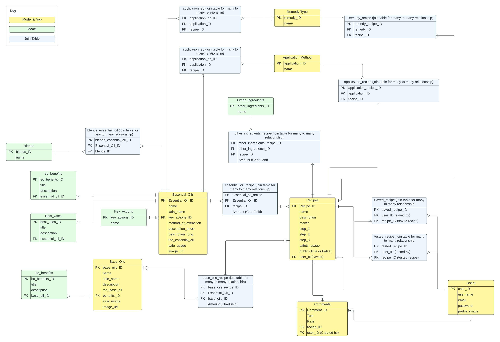

**User Journey**

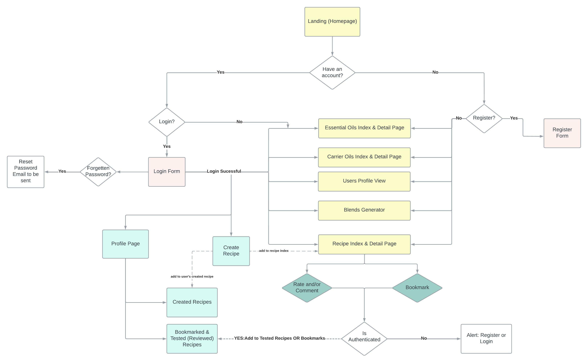

This was our original user journey, there are a couple of parts we didn’t have time to get round to - Password Reset function, Register/Login alert and Blend Generator - which are currently on our list of future improvements. 

**Trello**

We used Trello to create a daily to-do list as well as a list of features and user functionalities we wanted to include so as to keep on top of everything and avoid anything slipping through the net. 
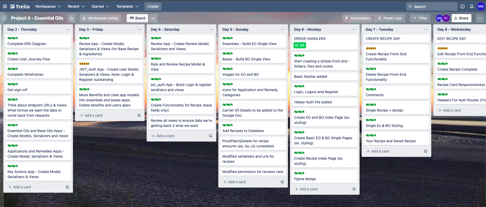

**Styling**

We used Figma for planning the styling and wireframing of the app. This was my first time using Figma and I found it invaluable, particularly when it came to styling. It found it a lot easier building and styling the pages when I had the Figma design to work to.
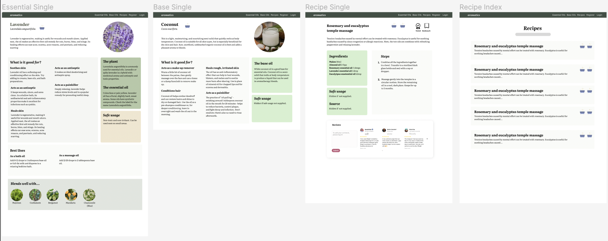

*** 

We wanted to keep a high level of communication throughout the project so we decided to spend the days on Zoom together. This also made sense as, particularly at the beginning of the project when we were working on the backend, we would be paircoding and live sharing our VSCode. We used Git and GitHub for version control and thought it best to do our pushes and pulls to GitHub together so as to avoid any merge conflicts that may arise. 

### Backend (Day 2 & 5)

This was the first time I was using Python to create the backend of an app. We used Django and Django REST Framework to create a PostgreSQL database. We had 7 apps (Applications, Bases, Essentials, Recipes, Jwt_auth (users), Recipes, Remedies and Reviews) and 17 models in total so we spent a good three and a half days building all the models, serializers and views. We wanted to ensure that everything was working as expected and the relationships we had planned were fit for the functionality we had designed. To help us do this, we used Tableplus to visualise our database and Insomnia to test our requests and ensure we were receiving the desired JSON responses. 

The most complex part of the backend was the recipe models, serializers and views. There were 5 models (recipe, otherIngredient, otherIngredientAmount, EssentialOilAmount, BaseOilAmount), four of which had Foreign Key Fields and ManyToMany relationships. 

**Featured Code - Create Recipe**

We first need to save the base recipe (“Recipe” Model) as we need the Recipe ID in order to save the ingredients. Therefore, we first remove the ingredients from the request data and we need the owner ID for the Recipe Model so this is added to the request data. Once this is serialized, validated and saved to the database, we loop through Essential Oil, Base Oil and Other Ingredient ingredient amounts which we removed from the original request, adding the Recipe Id to each item (ingredient amount), then serializing, validating and saving each item. 

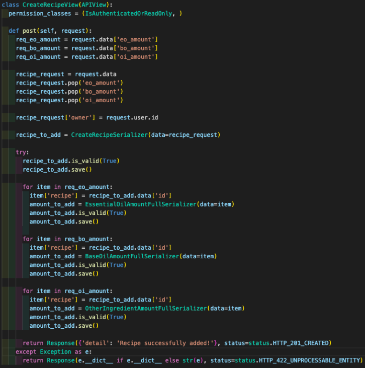

### Frontend (Days 6-9)

For the front end, we used React Hooks, Axios for the data requests from the backend and react-router-dom was used for page navigation in React. We also used a few React Components such as Toastify, Swiper, Simple Star Rating and the React Grid system, the latter was particularly useful when it came to making the app fully responsive. We used a combination of React Bootstrap and SCSS for styling. 

**Featured Code - Create Recipe - Dynamic Forms & React Select**

The challenging part to creating a recipe was the dynamic forms; we wanted the ingredient forms to start with one ingredient form (for each type of ingredient) and then expand when the user clicked to add more ingredients.We also wanted to use the React Select component for the ingredient name as we wanted users to select an ingredient from a drop-down list.  It was our first time using dynamic forms and React Select so there was a fair amount of Googling and reading up of the documentation and a lot of trial and error. 

We first created the dynamic form, without the React Select. Once we had got this working and the data being set to the recipeData state was in the right format, we moved onto the React Select. First, we created the options for the React Select form; we fetched the essential oil, base oil and other ingredient data and mapped through this to manipulate the data into a format required for the options (value: ingredient ID and label: ingredient name). This was then set to respective states (eg essentialOptions, baseOptions etc). 

We found we weren’t able to use the same HandleFormChange functions we were using for the measurement and quantity input fields as, after consoling logging the event, we found we couldn’t use event.target. Instead, the  ‘event’ had the same key value pairs as our “Options” state (value and label), so we used event.value which was the ingredient ID that we needed to set to the FormFields states which in turn would be used in setting the recipeData state.

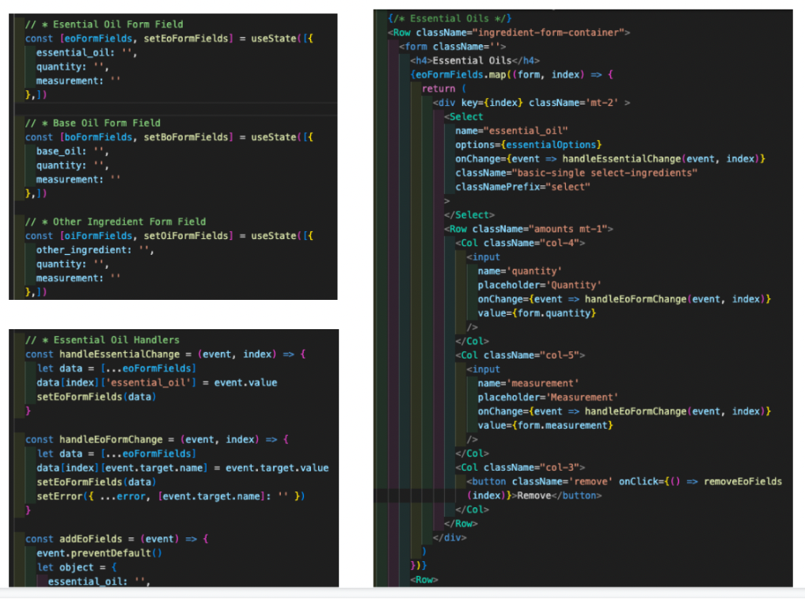

## Final Project (screenshot walkthrough)

**Homepage**
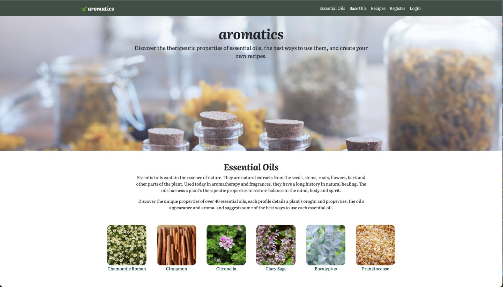

**Essential Oil Index Page**
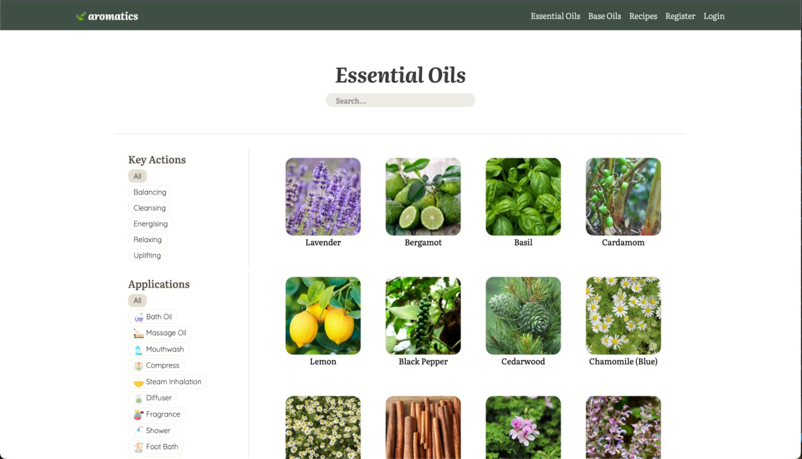

**Essential Oil Profile Page**
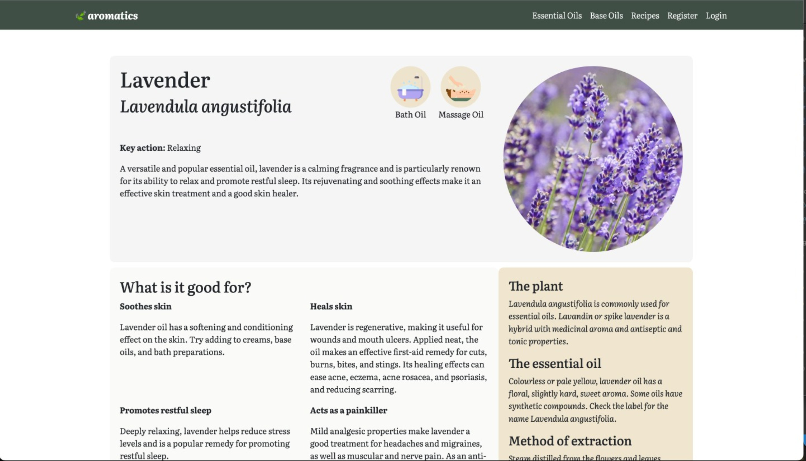

**Base Oil Index Page**
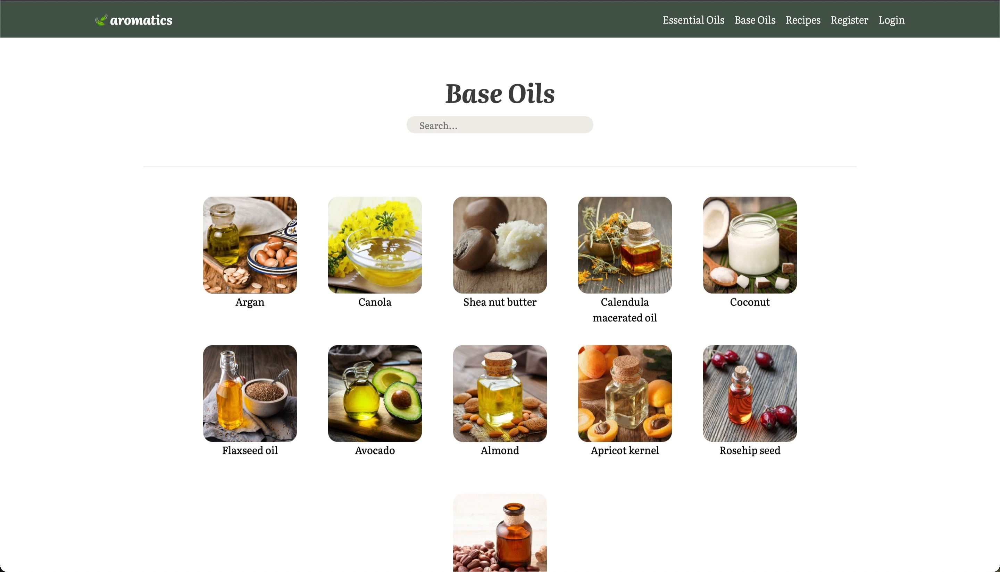

**Base Oil Profile Page**
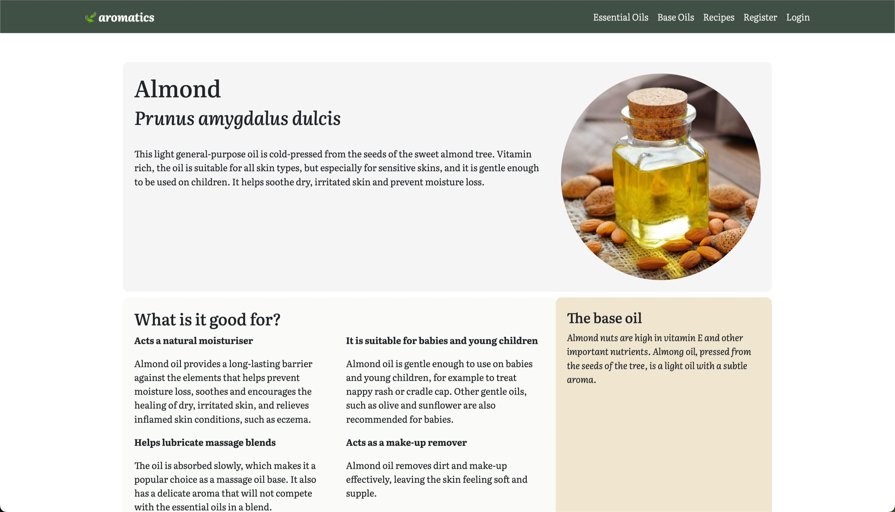

**Recipe Index Page**
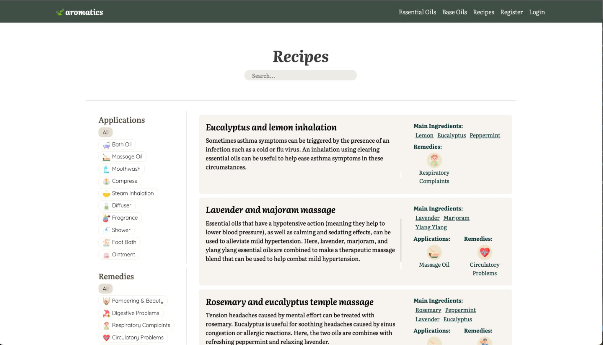

**Recipe Page**
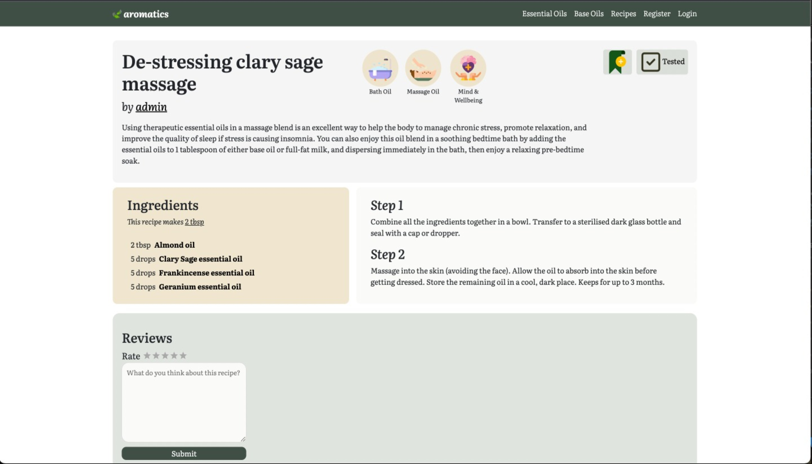

**Create Recipe**
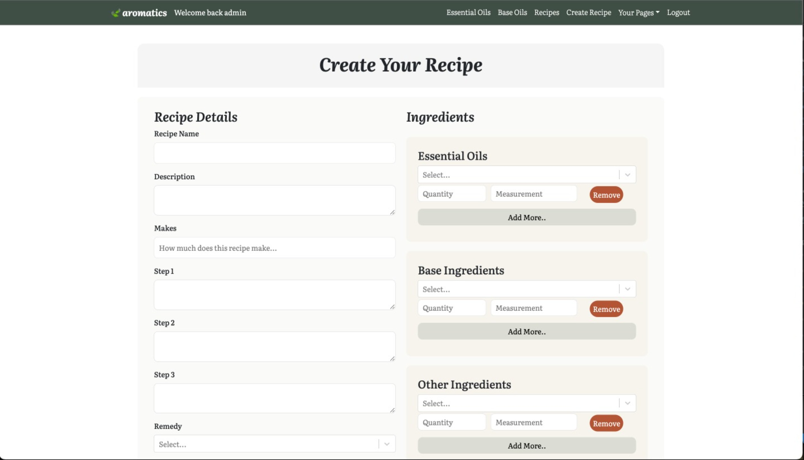

**Edit Recipe**
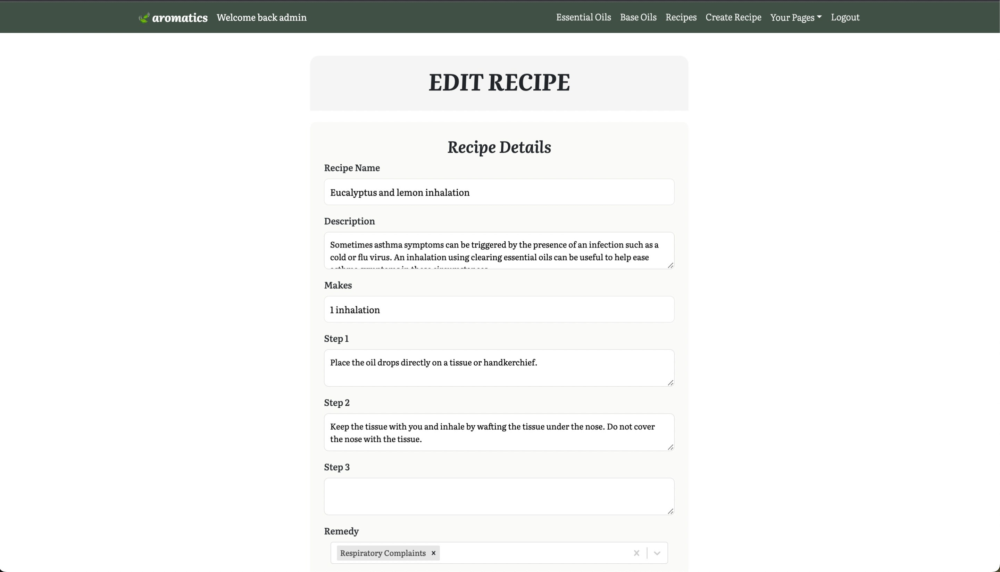

**Your Saved Recipes**
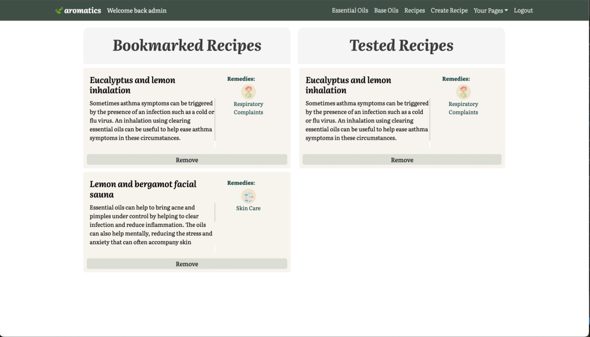

**Your Created Recipes**
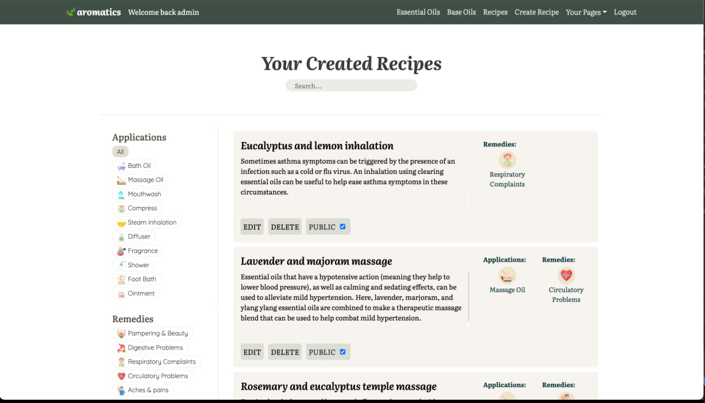

## Wins & Challenges

**Wins**: 
* I’m no doubt biased but I really love this app! I feel its responsive design across multiple platforms, user functionalities and depth make this a useful and enjoyable app to use. As a lover of aromatherapy, I’m definitely going to be using this app as my own personal recipe book!
* Also a challenge, the create recipe functionality was a big win and I’m pleased with how it turned out, particularly as this was the first using React Select and dynamic forms. 

**Challenges**: 
* Editing the Recipe
  * Editing the full recipe was a challenge, and one we didn’t completely surmount. Whilst we were able to populate the base recipe form with original recipe details and the user was able to edit these, we weren’t able to do the same for the ingredients. The ingredients needed to be dynamic forms which we struggled to populate with the original ingredients details. We’re confident that we’re able to edit the ingredients from a backend perspective, but without pre populating the forms on the frontend and creating a correctly formatted request body for the patch request we weren’t able to implement this.
* Serializers 
  * It felt like we had a lot of serializers and I sometimes found it hard to keep track of them all and where we were using them. This sometimes posed a challenge when we found we needed to amend serializers based on the data we were getting or posting from the frontend. As some were used in multiple views, we needed to ensure any amends we were making wouldn’t break anything elsewhere. 
* Error Handling
  * As we were using React Toast notifications, we wanted to use canned or bespoke responses for errors that we could display on the frontend. This required some amends to be made to the backend and where the responses were automated (for example, field and form validations using in_valid) we had to amend the frontend code. Example of the frontend error handling for the Registration page below.  

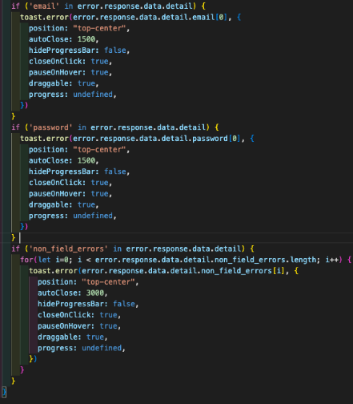

## Bugs

**Google Authentication**
 * The Google Authentication works when running on local servers, however, we’re having difficulties making it work when deployed on Heroku. 

**Recipe Creation**
  * If the user makes an error in the ingredients section - for example, adds a letter rather than a number in the quantity field - and submits the recipe, the “base” recipe section (everything other than ingredients) will be saved to the database (if there are no errors) but the ingredients section where the user made the error won’t be. As a result, once the user has corrected their mistake and they go to submit the recipe again, they will receive an error message saying the name of the recipe must be unique.
    * Not only does the user have to change the name of their recipe but this also results in recipes without ingredients in the database and displayed in the recipe index page.

## Future Content and Improvements

* Small Tweaks to User Model: 
  * Update email field to be emailField. 
  * Increase max length for username field.
* Blends Generator
* Password reset with email functionality 
* Redirect if users try to access authenticated routes when not logged in.
* Add share buttons to recipe pages - ie Social Media and Email buttons. 
* Add related recipes carousel/swiper to the bottom of recipe pages.
* Add drag and drop functionality for bookmarked and tested recipes page - e.g. allow the user to drag a recipe in their bookmarked list to their tested list (which will remove it from the bookmarked list and add it to the tested list). 

## Key Learnings

* I’ve gained a much stronger understanding of relational databases though doing this project and it’s sparked an interest in deepening my knowledge of Python. 
* Figma has revolutionised my styling, both in terms of ability and enjoyment. 
* I loved discovering React components such as Toast, Swiper, and Star Rating and it has opened my eyes to the wealth of React components available which I’m really excited to explore further in future projects.  

